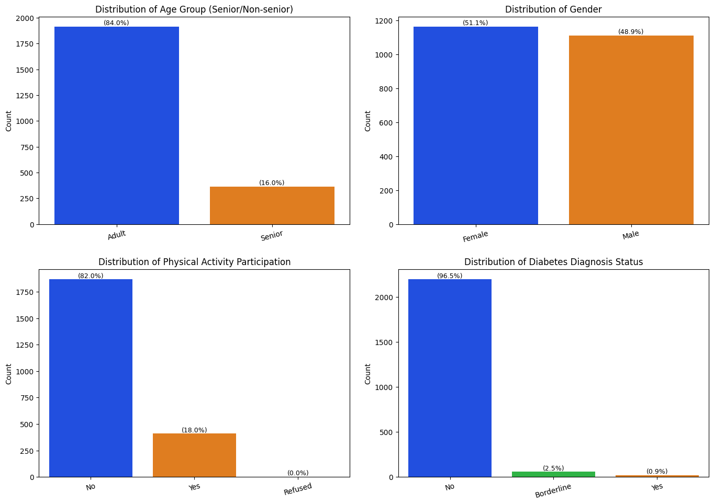
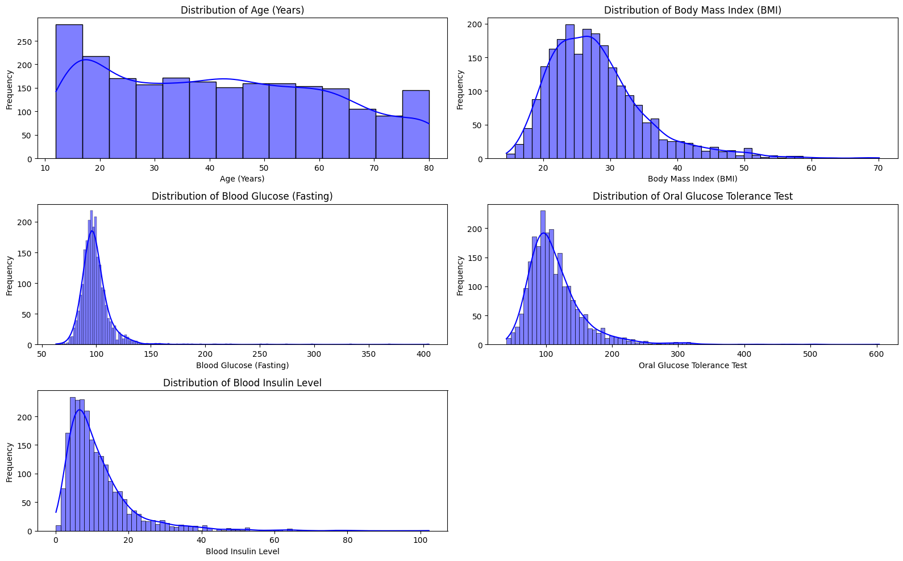
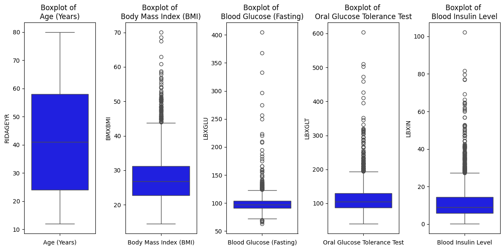
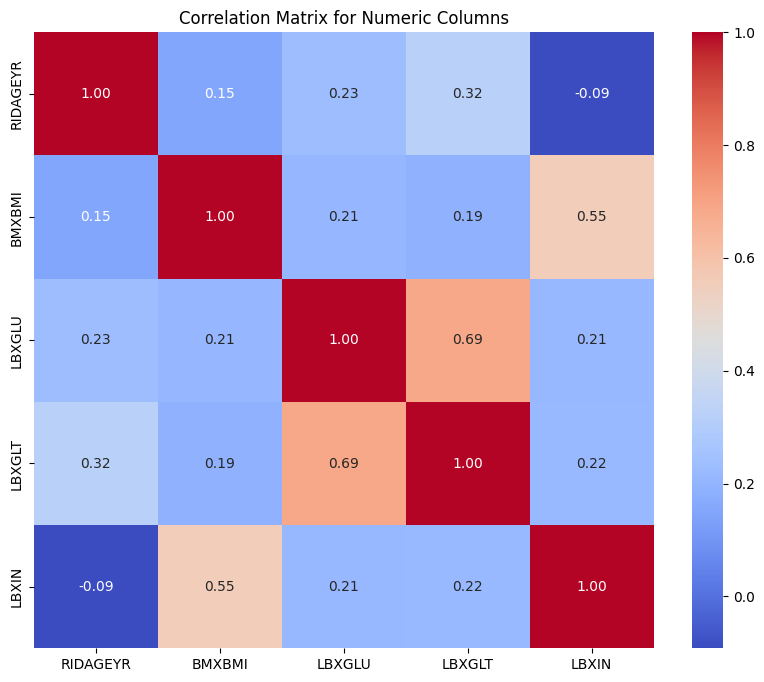
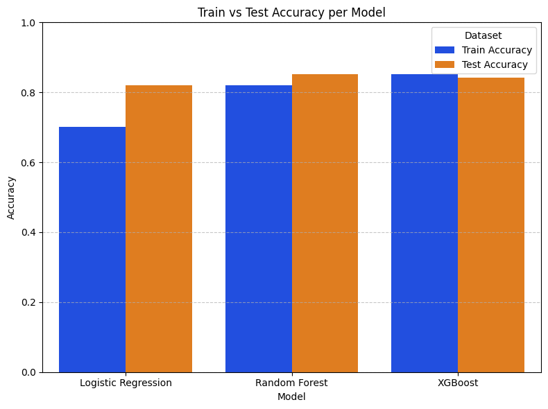

# Laporan Machine Learning Terapan 1 Predictive Analytics - Azrian Rifqi Radhitya

## Domain Proyek

Proyek ini bertujuan untuk mengklasifikasikan kelompok usia (senior/non-senior) berdasarkan data kesehatan dari survei NHANES. Klasifikasi kelompok usia berdasarkan indikator kesehatan menjadi sangat penting di era penuaan global saat ini, di mana populasi lanjut usia (senior) terus meningkat secara signifikan. Menurut World Health Organization (WHO), proporsi populasi dunia yang berusia di atas 60 tahun akan hampir dua kali lipat dari 12% menjadi 22% antara tahun 2015 dan 2050 [[1]](#1).

Prediksi klasifikasi kelompok usia berdasarkan data kesehatan memiliki beberapa manfaat penting:

1. **Perencanaan Kebijakan Kesehatan**: Memahami hubungan antara indikator kesehatan dan kelompok usia dapat membantu pemerintah dan institusi kesehatan dalam merencanakan program kesehatan yang tepat sasaran [[2]](#2).

2. **Alokasi Sumber Daya**: Dengan mengetahui karakteristik kesehatan berdasarkan kelompok usia, sumber daya kesehatan dapat dialokasikan secara lebih efektif, terutama untuk kelompok yang membutuhkan perhatian khusus [[3]](#3).

3. **Identifikasi Faktor Risiko**: Model klasifikasi dapat membantu mengidentifikasi faktor-faktor kesehatan yang paling berpengaruh terhadap penuaan, sehingga upaya preventif dapat difokuskan pada faktor-faktor tersebut [[4]](#4).

4. **Personalisasi Perawatan Kesehatan**: Hasil dari model klasifikasi dapat membantu dalam pengembangan pendekatan perawatan yang lebih personal berdasarkan profil kesehatan individu.

Masalah ini menjadi sangat relevan dalam konteks Indonesia, di mana menurut Badan Pusat Statistik (BPS), struktur demografi Indonesia mulai mengarah pada fenomena "ageing population" dengan persentase penduduk lanjut usia (60 tahun ke atas) yang meningkat signifikan dari tahun 2020, diperkirakan melebihi 10 persen. Proyeksi BPS bahkan menunjukkan bahwa pada tahun 2045, lansia diperkirakan akan mencapai hampir seperlima dari total populasi Indonesia [[5]](#5). Dengan memahami hubungan antara data kesehatan dan kelompok usia, kita dapat mengembangkan strategi yang lebih efektif untuk meningkatkan kualitas hidup dan kesejahteraan seluruh lapisan masyarakat, terutama kelompok lanjut usia yang semakin bertambah.

## Business Understanding

### Problem Statements
- Bagaimana cara mengklasifikasikan kelompok usia (senior/non-senior) secara akurat berdasarkan indikator kesehatan yang tersedia dalam dataset NHANES?
- Apa saja faktor atau indikator kesehatan yang paling berpengaruh dalam menentukan kelompok usia seseorang?
- Bagaimana cara menangani ketidakseimbangan data pada kategori target (senior/non-senior) untuk mendapatkan model yang handal?

### Goals
- Mengembangkan model machine learning yang dapat mengklasifikasikan kelompok usia (senior/non-senior) dengan akurasi tinggi berdasarkan indikator kesehatan.
- Mengidentifikasi dan menganalisis fitur-fitur penting yang memiliki pengaruh signifikan dalam klasifikasi kelompok usia.
- Mengatasi masalah ketidakseimbangan data untuk memastikan model dapat memprediksi kedua kelas dengan baik.

### Solution Statements
1. **Implementasi Multiple Machine Learning Algorithms**:
   - Menggunakan algoritma Logistic Regression sebagai baseline model karena interpretabilitasnya yang tinggi dalam masalah klasifikasi biner.
   - Menerapkan algoritma Random Forest untuk menangkap pola non-linear dan interaksi kompleks antar fitur kesehatan.
   - Mengimplementasikan XGBoost yang dikenal memiliki performa tinggi untuk berbagai masalah klasifikasi.

2. **Visualisasi Korelasi Data terhadap Kelompok Usia melalui EDA**:
   - Menerapkan analisis korelasi untuk menentukan indikator kesehatan yang memiliki hubungan kuat dengan kelompok usia
   - Menggunakan heatmap, boxplot, dan histogram untuk memvisualisasikan hubungan antara fitur dan target, sehingga memudahkan interpretasi pengaruh masing-masing indikator kesehatan

3. **Penanganan Data Tidak Seimbang**:
   - Menerapkan teknik oversampling dengan SMOTE (Synthetic Minority Over-sampling Technique) untuk menyeimbangkan distribusi kelas target.

## Data Understanding

Dataset yang digunakan adalah "National Health and Nutrition Health Survey 2013-2014 (NHANES) Age Prediction Subset" [[6]](#6) yang dapat diunduh dari [UCI Machine Learning Repository](https://archive.ics.uci.edu/dataset/887/national+health+and+nutrition+health+survey+2013-2014+(nhanes)+age+prediction+subset). Dataset ini merupakan subset dari survei kesehatan nasional Amerika Serikat yang berisi 2278 sampel dengan 10 variabel yang mencakup informasi demografis dan indikator kesehatan.

NHANES (National Health and Nutrition Examination Survey) adalah program penelitian yang dirancang untuk menilai kesehatan dan status gizi orang dewasa dan anak-anak di Amerika Serikat. Survei ini menggabungkan wawancara dan pemeriksaan fisik, menjadikannya sumber data yang komprehensif untuk analisis kesehatan populasi.

### Variabel-variabel pada dataset:
| Column Name | Type     | Data Type   | Description                                                                                   | Target |
|-------------|----------|-------------|-----------------------------------------------------------------------------------------------|--------|
| SEQN        | ID       | Continuous  | Respondent Sequence Number                                                                    | no     |
| age_group   | Target   | Categorical | respondents 65 years old and older were labeled  as “senior” and all individuals under 65 years old as “non-senior.”                              | yes    |
| RIDAGEYR    | Other    | Continuous  | Respondent's Age                                                                              | no     |
| RIAGENDR    | Feature  | Categorical | Respondent's Gender                                                                           | no     |
| PAQ605      | Feature  | Categorical | Participation in moderate or vigorous-intensity physical activity in a typical week           | no     |
| BMXBMI      | Feature  | Continuous  | Respondent's Body Mass Index                                                                  | no     |
| LBXGLU      | Feature  | Continuous  | Respondent's Blood Glucose after fasting                                                      | no     |
| DIQ010      | Feature  | Categorical | Diabetes status of the respondent                                                             | no     |
| LBXGLT      | Feature  | Continuous  | Respondent's Oral Glucose Tolerance Test result                                               | no     |
| LBXIN       | Feature  | Continuous  | Respondent's Blood Insulin Levels                                                             | no     |

### Exploratory Data Analysis

Analisis eksplorasi data dilakukan untuk memahami karakteristik dan pola dalam dataset, serta untuk mengidentifikasi potensi masalah yang perlu ditangani sebelum pemodelan.

#### 1. Analisis Univariat - Variabel Kategorikal

Berikut adalah hasil analisis terhadap variabel kategorikal dalam dataset:

- **age_group (Target)**: Terdapat ketidakseimbangan yang signifikan, dengan kategori non-senior mendominasi sebanyak 84% dan senior hanya 16%. Ketidakseimbangan ini perlu ditangani untuk menghindari bias dalam model.

- **RIAGENDR (Gender)**: Distribusi gender cukup seimbang dengan sedikit dominasi perempuan (51.1%) dibandingkan laki-laki (48.9%).

- **PAQ605 (Aktivitas Fisik)**: Mayoritas responden (82%) melaporkan tidak melakukan aktivitas fisik intensitas tinggi, sementara hanya 18% yang melakukan aktivitas fisik secara teratur. Hal ini menunjukkan potensi gaya hidup sedentari yang tinggi di populasi sampel.

- **DIQ010 (Status Diabetes)**: Sebagian besar responden (96.5%) tidak memiliki diagnosis diabetes, sementara 3.5% terdiagnosis dengan kondisi tersebut. Meskipun persentasenya kecil, proporsi ini konsisten dengan prevalensi diabetes di populasi umum.

#### 2. Analisis Univariat - Variabel Numerik

Analisis terhadap variabel numerik mengungkapkan informasi penting tentang distribusi indikator kesehatan:

- **RIDAGEYR (Usia)**: Distribusi usia relatif merata dengan konsentrasi yang lebih tinggi pada kelompok usia 12-30 tahun. Mean usia adalah 42.3 tahun dengan standar deviasi 22.6 tahun.

- **BMXBMI (Indeks Massa Tubuh)**: Distribusi BMI mendekati normal dengan sedikit kecenderungan positif (right-skewed). Mayoritas nilai berada di rentang 25-30, yang mengindikasikan prevalensi kelebihan berat badan (overweight) yang cukup tinggi dalam sampel. Mean BMI adalah 28.2 kg/m² dengan standar deviasi 6.7 kg/m².

- **LBXGLU (Glukosa Puasa)** dan **LBXGLT (Tes Toleransi Glukosa)**: Kedua variabel ini menunjukkan distribusi yang miring ke kanan (right-skewed), yang umum untuk pengukuran glukosa darah. Nilai yang jauh di atas rata-rata menunjukkan adanya subpopulasi dengan kadar glukosa tinggi, yang mungkin mengindikasikan kondisi prediabetes atau diabetes. Mean LBXGLU adalah 103.2 mg/dL dengan standar deviasi 29.8 mg/dL.

- **LBXIN (Kadar Insulin Darah)**: Distribusi sangat miring ke kanan (heavily right-skewed) yang mengindikasikan sebagian kecil responden memiliki kadar insulin sangat tinggi, potensial menunjukkan adanya resistensi insulin. Mean LBXIN adalah 13.9 μU/mL dengan standar deviasi 12.4 μU/mL.

#### 3. Analisis Outlier

Dari visualisasi box plot untuk variabel numerik, terdeteksi adanya outlier yang signifikan pada beberapa variabel:

- **BMXBMI**: Terdapat outlier di atas 45 kg/m², yang mengindikasikan kasus obesitas ekstrem.
- **LBXGLU**: Terdapat outlier di atas 200 mg/dL, yang mungkin mengindikasikan kasus diabetes tidak terkontrol.
- **LBXGLT**: Terdapat outlier di atas 300 mg/dL, mengindikasikan toleransi glukosa yang sangat buruk.
- **LBXIN**: Terdapat outlier ekstrem hingga di atas 100 μU/mL, mengindikasikan kemungkinan resistensi insulin yang parah.

Outlier-outlier ini perlu ditangani karena dapat mempengaruhi performa model machine learning.

#### 4. Analisis Korelasi

Analisis korelasi antara variabel numerik mengungkapkan pola hubungan yang penting dalam menentukan kelompok usia:

- **Hubungan Antara Usia dan Indikator Metabolik**: Ditemukan korelasi positif antara variabel RIDAGEYR (usia) dengan indikator metabolik utama (LBXGLU, LBXGLT), yang mengkonfirmasi bahwa faktor-faktor ini berpotensi menjadi prediktor kelompok usia yang signifikan.

- **Indikator Glukosa**: LBXGLU (Glukosa Puasa) dan LBXGLT (Tes Toleransi Glukosa) menunjukkan korelasi positif yang kuat (0.69), dan keduanya memiliki korelasi positif dengan usia. Hal ini mengindikasikan bahwa metabolisme glukosa berubah secara signifikan dengan pertambahan usia dan dapat menjadi prediktor penting untuk klasifikasi kelompok usia.

- **Indeks Massa Tubuh dan Insulin**: Korelasi positif sedang (0.55) antara BMXBMI (Indeks Massa Tubuh) dan LBXIN (Kadar Insulin) menunjukkan keterkaitan antara berat badan dan metabolisme insulin. Meskipun korelasinya dengan usia tidak terlalu kuat, kombinasi kedua faktor ini berpotensi menjadi prediktor tidak langsung untuk kelompok usia melalui interaksinya dengan metabolisme glukosa.

- **Faktor Paling Berpengaruh**: Berdasarkan analisis korelasi, LBXGLU (Glukosa Puasa) dan LBXGLT (Tes Toleransi Glukosa) muncul sebagai indikator kesehatan yang paling berpengaruh dalam menentukan kelompok usia, diikuti oleh BMXBMI dan LBXIN yang memiliki pengaruh moderat.

Temuan ini mendukung salah satu tujuan utama proyek yaitu mengidentifikasi faktor-faktor kesehatan yang paling berpengaruh dalam klasifikasi kelompok usia. Perubahan metabolisme glukosa tampaknya menjadi biomarker penuaan yang lebih kuat dibandingkan indikator lainnya, sejalan dengan literatur medis yang menunjukkan peningkatan risiko gangguan metabolisme glukosa seiring bertambahnya usia.

## Data Preparation

Data preparation merupakan tahap krusial untuk memastikan data siap digunakan dalam pemodelan machine learning. Berikut adalah langkah-langkah yang dilakukan beserta alasannya:

### 1. Pemeriksaan Missing Values dan Duplikasi

```python
# Check for duplicates 
duplicate_rows = df[df.duplicated()]
if not duplicate_rows.empty:
    print("Duplicate Rows:")
    display(duplicate_rows)
else:
    print("No duplicate rows found.")

# Check for missing values 
missing_values = df.isna().sum()
missing_columns = missing_values[missing_values > 0]
if not missing_columns.empty:
    print("\nMissing Values:")
    display(missing_columns)
else:
    print("\nNo missing values found.")
```

Hasil pemeriksaan menunjukkan tidak ada duplikasi atau missing values pada dataset. Pemeriksaan ini penting dilakukan karena:
- Missing values dapat menyebabkan bias dan mengurangi akurasi model
- Duplikasi data dapat menyebabkan overfitting dan bias pada model

### 2. Penghapusan Kolom yang Tidak Relevan

```python
# Irrelevant columns: SEQN (respondent sequence number) and RIDAGEYR (respondent age)
irrelevant_columns = ['SEQN', 'RIDAGEYR']
df.drop(columns=irrelevant_columns, inplace=True)
```

Kolom `SEQN` dan `RIDAGEYR` dihapus dengan alasan:
- `SEQN` (Respondent Sequence Number) hanya berfungsi sebagai ID dan tidak memiliki nilai prediktif
- `RIDAGEYR` (Respondent's Age) dihapus karena berkorelasi langsung dengan variabel target `age_group`, yang dapat menyebabkan data leakage dan menghasilkan model yang overfitting.

### 3. Penanganan Outlier dengan Metode IQR

```python
numerical = ['BMXBMI', 'LBXGLU', 'LBXGLT', 'LBXIN']
def remove_outliers_iqr(df, columns):
    for col in columns:
        Q1 = df[col].quantile(0.25)
        Q3 = df[col].quantile(0.75)
        IQR = Q3 - Q1
        lower_bound = Q1 - 1.5 * IQR
        upper_bound = Q3 + 1.5 * IQR
        df = df[(df[col] >= lower_bound) & (df[col] <= upper_bound)]
    return df

df_clean = remove_outliers_iqr(df, numerical)
```

Penanganan outlier menggunakan metode IQR (Interquartile Range) dilakukan karena:
- Outlier dapat menyebabkan distorsi pada model machine learning, terutama pada algoritma yang sensitif terhadap distribusi data seperti Logistic Regression
- Metode IQR dipilih karena lebih robust dibandingkan metode berbasis mean dan standard deviation, terutama untuk data yang tidak berdistribusi normal
- Variabel yang diproses (`BMXBMI`, `LBXGLU`, `LBXGLT`, dan `LBXIN`) menunjukkan adanya outlier signifikan berdasarkan analisis box plot sebelumnya

### 4. Encoding Kolom Target

```python
encoder = LabelEncoder()
df_clean['age_group'] = encoder.fit_transform(df_clean['age_group'])
print(encoder.classes_)
```

Label Encoding diterapkan pada kolom target `age_group` untuk mengubah nilai kategorikal menjadi numerik karena:
- Algoritma machine learning membutuhkan input numerik
- Untuk klasifikasi biner seperti dalam kasus ini (senior/non-senior), Label Encoding lebih efisien dibandingkan One-Hot Encoding
- Menjaga hubungan ordinal antara kelas (non-senior = 0, senior = 1)

### 5. Pembagian Data (Train-Test Split)

```python
# Features and target
X = df_clean.drop(columns=['age_group'])
y = df_clean['age_group']

# Split the data into training and testing sets 
X_train, X_test, y_train, y_test = train_test_split(X, y, test_size=0.2, random_state=42, stratify=y)
```

Data dibagi menjadi training set (80%) dan testing set (20%) dengan alasan:
- Proporsi 80:20 merupakan pembagian yang umum digunakan dalam praktik machine learning
- Parameter `stratify=y` digunakan untuk memastikan distribusi kelas target tetap proporsional pada kedua set data, terutama penting karena adanya ketidakseimbangan kelas
- `random_state=42` untuk memastikan reproducibility hasil

### 6. Oversampling dengan SMOTE

```python
# Konfigurasi SMOTE hanya untuk target 'age_group'
smote = SMOTE(sampling_strategy='0.5', random_state=42)
X_resampled, y_resampled = smote.fit_resample(X_train, y_train)
```
SMOTE (Synthetic Minority Over-sampling Technique) [[7]](#7) diterapkan untuk menangani ketidakseimbangan kelas karena:
- Data target sangat tidak seimbang (84% non-senior, 16% senior)
- SMOTE membuat sampel sintetis dari kelas minoritas (senior) berdasarkan kelas yang sudah ada, sehingga lebih baik daripada random oversampling yang dapat menyebabkan overfitting
- Teknik ini membantu model untuk lebih memahami pola dari kelas minoritas
- Hasil SMOTE dengan parameter `sampling_strategy=0.5` menghasilkan rasio kelas minoritas:mayoritas sebesar 1:2, yang berarti jumlah sampel kelas minoritas (senior) menjadi setengah dari jumlah sampel kelas mayoritas (non-senior), meningkatkan representasi kelas minoritas tanpa mencapai keseimbangan penuh

### 7. Feature Scaling dengan StandardScaler

```python
# Inisialisasi scaler
scaler = StandardScaler()

# Fit & transform hanya kolom numerik
X_resampled_scaled[numerical] = scaler.fit_transform(X_resampled[numerical])
X_test_scaled[numerical] = scaler.transform(X_test[numerical])
```

Feature scaling dengan StandardScaler dilakukan karena:
- Algoritma seperti Logistic Regression sangat sensitif terhadap skala fitur
- Standardisasi memastikan semua fitur numerik memiliki mean=0 dan standard deviation=1, sehingga variabel dengan skala besar tidak mendominasi model
- Hanya dilakukan pada fitur numerik (`BMXBMI`, `LBXGLU`, `LBXGLT`, dan `LBXIN`) karena fitur kategorikal sudah diencoding
- StandardScaler dipilih dibandingkan MinMaxScaler karena lebih robust terhadap outlier yang mungkin masih tersisa

Proses preprocessing data ini memastikan bahwa dataset telah siap untuk dimasukkan ke dalam model machine learning dengan kualitas yang optimal.

## Modeling

Pada tahap ini, tiga algoritma machine learning diterapkan untuk klasifikasi kelompok usia: Logistic Regression, Random Forest, dan XGBoost. Setiap algoritma memiliki karakteristik, cara kerja, dan kelebihan yang berbeda, yang akan dijelaskan berikut ini.

### 1. Logistic Regression

```python
logreg_model = LogisticRegression(
    solver='liblinear',
    random_state=42
)
```

**Cara Kerja:**

Logistic Regression adalah metode statistik yang digunakan untuk menganalisis dataset di mana terdapat satu atau lebih variabel independen yang menentukan outcome. Algoritma ini bekerja dengan menghitung probabilitas keanggotaan kelas menggunakan fungsi sigmoid [[10]](#10):


$$P(y=1|x) = \frac{1}{1 + e^{-(β_0 + β_1 x_1 + ... + β_n x_n)}}$$

Dimana:
- $P(y=1|x)$ adalah probabilitas bahwa sampel termasuk dalam kelas positif (senior)
- $β_0, β_1, ..., β_n$ adalah koefisien model
- $x_1, x_2, ..., x_n$ adalah fitur input

Berbeda dengan regresi linear, output logistic regression dibatasi antara 0 dan 1 melalui fungsi sigmoid, sehingga cocok untuk masalah klasifikasi biner seperti dalam kasus ini [[11]](#11).

**Parameter:**
- `solver='liblinear'`: Algoritma untuk optimasi, dipilih karena efisien untuk dataset dengan ukuran medium dan klasifikasi biner
- `random_state=42`: Untuk memastikan reproducibility hasil

**Kelebihan:**
- Interpretabilitas yang tinggi, memungkinkan analisis koefisien untuk menentukan kontribusi relatif setiap fitur
- Computationally efficient, cepat dilatih bahkan pada dataset besar
- Memberikan probabilitas kelas yang terkalibrasi dengan baik

**Kekurangan:**
- Kurang mampu menangkap pola non-linear yang kompleks
- Asumsi independensi antar fitur yang tidak selalu terpenuhi dalam data nyata
- Performa dapat menurun jika hubungan antara fitur dan target sangat kompleks

### 2. Random Forest

```python
rf_model = RandomForestClassifier(
    n_estimators=100,
    max_depth=5,
    min_samples_split=5,
    min_samples_leaf=3,
    random_state=42
)
```

**Cara Kerja:**

Random Forest adalah algoritma ensemble learning yang bekerja dengan membangun banyak decision tree selama training dan menghasilkan kelas yang merupakan mode dari kelas-kelas (klasifikasi) individual trees [[12]](#12). Algoritma ini menggunakan teknik bagging (bootstrap aggregating) untuk meningkatkan stabilitas dan akurasi.


Langkah-langkah dalam Random Forest:

1. **Bootstrap Sampling**: Ambil sampel dengan penggantian dari dataset training
2. **Random Feature Selection**: Untuk setiap node dalam tree, pilih subset acak dari fitur
3. **Decision Tree Building**: Bangun decision tree menggunakan sampel bootstrap dan fitur terpilih
4. **Voting**: Untuk prediksi, setiap tree memberikan "vote" dan kelas dengan vote terbanyak menjadi prediksi akhir

Random Forest mampu menangani masalah overfitting yang sering terjadi pada decision tree tunggal karena averaging banyak tree mengurangi variance [[13]](#13).

**Parameter:**
- `n_estimators=100`: Jumlah pohon keputusan dalam ensemble
- `max_depth=5`: Kedalaman maksimum setiap pohon, untuk mencegah overfitting
- `min_samples_split=5`: Minimal jumlah sampel yang diperlukan untuk split node
- `min_samples_leaf=3`: Minimal jumlah sampel yang harus ada di leaf node
- `random_state=42`: Untuk memastikan reproducibility hasil

**Kelebihan:**
- Mampu menangkap hubungan non-linear dan interaksi kompleks antar fitur
- Robust terhadap outlier dan nilai yang hilang
- Relatif tidak rentan terhadap overfitting karena konsensus dari banyak pohon
- Menyediakan feature importance, memungkinkan analisis fitur yang berpengaruh

**Kekurangan:**
- Kurang interpretable dibandingkan Logistic Regression
- Membutuhkan lebih banyak memori dan waktu komputasi
- Dapat bias terhadap fitur dengan banyak level unik

### 3. XGBoost

```python
xgb_model = XGBClassifier(
    n_estimators=100,
    max_depth=3,
    learning_rate=0.1,
    subsample=0.8,
    colsample_bytree=0.8,
    reg_alpha=0.1,  # L1 regularization
    reg_lambda=1,   # L2 regularization
    use_label_encoder=False,
    eval_metric='logloss',
    random_state=42
)
```

**Cara Kerja:**

XGBoost (eXtreme Gradient Boosting) adalah implementasi yang dioptimalkan dari algoritma gradient boosting tree yang didesain untuk performa dan kecepatan tinggi [[14]](#14). Berbeda dengan Random Forest yang menggunakan bagging, XGBoost menggunakan teknik boosting di mana model dibangun secara sekuensial, dengan setiap model baru berusaha memperbaiki kesalahan dari model sebelumnya.


Langkah kerja XGBoost:

1. **Inisialisasi**: Buat prediktor awal sederhana
2. **Iterasi untuk m = 1 hingga M**:
   - Hitung gradien dan hessian dari fungsi loss terhadap prediksi saat ini
   - Bangun tree baru untuk memodelkan gradien (residual error)
   - Tambahkan tree ke model dengan faktor shrinkage (learning rate)
3. **Output**: Model final yang merupakan kombinasi dari semua tree

XGBoost menggunakan regularisasi untuk mencegah overfitting dan memiliki beberapa optimasi seperti penggunaan aproksimasi split untuk penanganan dataset besar [[15]](#15).

**Parameter:**
- `n_estimators=100`: Jumlah pohon dalam ensemble
- `max_depth=3`: Kedalaman maksimum setiap pohon
- `learning_rate=0.1`: Laju pembelajaran yang mengontrol kontribusi setiap pohon
- `subsample=0.8`: Fraksi sampel yang digunakan untuk setiap pohon (80%)
- `colsample_bytree=0.8`: Fraksi fitur yang digunakan untuk setiap pohon (80%)
- `reg_alpha=0.1`: Parameter regularisasi L1 yang mengendalikan kompleksitas model dengan menambahkan penalti pada besarnya koefisien, membantu menangani fitur yang tidak relevan  
- `reg_lambda=1`: Parameter regularisasi L2 yang mengendalikan kompleksitas model dengan menambahkan penalti pada kuadrat koefisien, membantu mencegah overfitting
- `use_label_encoder=False`: Tidak menggunakan encoder internal
- `eval_metric='logloss'`: Metrik evaluasi yang digunakan selama pelatihan
- `random_state=42`: Untuk memastikan reproducibility hasil

**Kelebihan:**
- Performa yang sangat baik pada berbagai masalah machine learning
- Efisien dalam waktu dan memori karena implementasi gradient boosting yang dioptimalkan
- Memiliki teknik regularisasi built-in untuk mencegah overfitting
- Dapat menangani berbagai jenis data tanpa preprocessing ekstensif
- Menyediakan feature importance yang dapat digunakan untuk interpretasi

**Kekurangan:**
- Lebih sulit untuk parameter tuning dibandingkan algoritma lain
- Kecenderungan overfitting jika parameter tidak dikonfigurasi dengan baik
- Kurang interpretable dibandingkan model yang lebih sederhana

### Proses Pemilihan Model

Ketiga model ini dipilih dengan pertimbangan:

1. **Diversity Algoritma**: Logistic Regression (linear), Random Forest (ensemble bagging), dan XGBoost (ensemble boosting) mewakili tiga pendekatan yang berbeda dalam machine learning, memberikan perspektif yang beragam terhadap masalah.

2. **Trade-off Interpretabilitas vs Performa**: Logistic Regression memberikan interpretabilitas tinggi, sementara Random Forest dan XGBoost dapat menangkap pola kompleks dengan performa yang lebih baik.

Model terbaik akan dipilih berdasarkan evaluasi performa pada data testing, dengan mempertimbangkan metrik evaluasi yang relevan untuk kasus klasifikasi dengan ketidakseimbangan kelas.

## Evaluation

Evaluasi model adalah tahap penting untuk mengukur seberapa baik model bekerja dan memilih model terbaik untuk digunakan. Berikut adalah penjelasan detail mengenai metrik evaluasi yang digunakan dan hasil yang diperoleh.

### Metrik Evaluasi

Untuk masalah klasifikasi biner dengan ketidakseimbangan kelas seperti dalam proyek ini, beberapa metrik evaluasi digunakan:

1. **Accuracy (Akurasi)**

   Accuracy mengukur rasio prediksi benar terhadap total prediksi [[8]](#8).

   $\text{Accuracy} = \frac{TP + TN}{TP + TN + FP + FN}$

   Dimana:
   - TP (True Positive): Kasus senior yang diprediksi dengan benar
   - TN (True Negative): Kasus non-senior yang diprediksi dengan benar
   - FP (False Positive): Kasus non-senior yang salah diprediksi sebagai senior
   - FN (False Negative): Kasus senior yang salah diprediksi sebagai non-senior

   Meskipun accuracy sering digunakan, metrik ini memiliki keterbatasan pada dataset tidak seimbang, karena model yang selalu memprediksi kelas mayoritas masih dapat mencapai accuracy yang tinggi.

2. **Precision (Presisi)**

   Precision mengukur akurasi prediksi positif, yaitu seberapa tepat model mengidentifikasi kelas positif [[9]](#9).

   $\text{Precision} = \frac{TP}{TP + FP}$

   Presisi tinggi menunjukkan bahwa ketika model memprediksi seseorang sebagai 'senior', prediksi tersebut cenderung benar.

3. **Recall (Sensitivitas)**

   Recall mengukur kemampuan model dalam mendeteksi semua kasus positif [[9]](#9).

   $\text{Recall} = \frac{TP}{TP + FN}$

   Recall tinggi menunjukkan bahwa model dapat mengidentifikasi sebagian besar individu yang sebenarnya 'senior'.

4. **F1-Score**

   F1-Score adalah harmonic mean dari precision dan recall, memberikan ukuran tunggal yang menyeimbangkan kedua metrik tersebut [[9]](#9).

   $\text{F1-Score} = 2 \times \frac{\text{Precision} \times \text{Recall}}{\text{Precision} + \text{Recall}}$

   F1-Score sangat berguna untuk dataset tidak seimbang, karena memberikan bobot yang sama pada precision dan recall.

### Hasil Evaluasi Model


Berikut adalah tabel hasil evaluasi ketiga model pada data testing:

| Model | Kelas | Akurasi Testing | Akurasi Training | Precision | Recall | F1-Score |
|-------|-------|----------------|------------------|-----------|--------|----------|
| Logistic Regression | Adult | 0.821053 | 0.700617 | 0.892966 | 0.898462 | 0.895706 |
| Logistic Regression | Senior | 0.821053 | 0.700617 | 0.377358 | 0.363636 | 0.370370 |
| Random Forest | Adult | 0.852632 | 0.819959 | 0.874652 | 0.966154 | 0.918129 |
| Random Forest | Senior | 0.852632 | 0.819959 | 0.476190 | 0.181818 | 0.263158 |
| XGBoost | Adult | 0.842105 | 0.851852 | 0.873239 | 0.953846 | 0.911765 |
| XGBoost | Senior | 0.842105 | 0.851852 | 0.400000 | 0.181818 | 0.250000 |

### Visualisasi Hasil



### Analisis Hasil

Berdasarkan hasil evaluasi di atas, dapat diambil beberapa kesimpulan:

1. **Akurasi**:
   - Random Forest memiliki akurasi testing tertinggi (85.3%), diikuti oleh XGBoost (84.2%) dan Logistic Regression (82.1%).
   - XGBoost menunjukkan keseimbangan terbaik antara akurasi training (85.2%) dan testing (84.2%), menunjukkan generalisasi yang baik.
   - Logistic Regression memiliki akurasi training (70.1%) yang lebih rendah dari testing (82.1%), yang tidak biasa dan mungkin mengindikasikan keterbatasan model dalam mempelajari pola kompleks dalam data training.

2. **Precision dan Recall**:
   - Semua model memiliki precision dan recall yang tinggi untuk kelas "Adult", yang menunjukkan kemampuan baik dalam mengidentifikasi kelompok mayoritas.
   - Untuk kelas "Senior" (kelas minoritas), precision tertinggi dimiliki oleh Random Forest (47.6%), diikuti XGBoost (40.0%) dan Logistic Regression (37.7%).
   - Recall untuk kelas "Senior" relatif rendah di semua model, dengan Logistic Regression memiliki nilai terbaik (36.4%), jauh lebih baik dibandingkan Random Forest dan XGBoost (keduanya 18.2%).

3. **F1-Score**:
   - Logistic Regression memiliki F1-Score tertinggi untuk kelas "Senior" (37.0%), menunjukkan keseimbangan terbaik antara precision dan recall untuk kelas minoritas.
   - Random Forest memiliki F1-Score 26.3% untuk kelas "Senior".
   - XGBoost memiliki F1-Score terendah untuk kelas "Senior" (25.0%).

4. **Trade-off antara Overfitting dan Generalisasi**:
   - XGBoost menunjukkan tingkat generalisasi terbaik dengan selisih kecil antara performa training dan testing.
   - Random Forest menunjukkan kesenjangan moderat antara akurasi training dan testing.
   - Logistic Regression memiliki pola unik dimana performa testing lebih baik dari training, yang mungkin mengindikasikan bahwa model terlalu sederhana untuk data training yang lebih beragam.

### Pemilihan Model Terbaik

Berdasarkan evaluasi komprehensif, meskipun Random Forest memiliki akurasi keseluruhan tertinggi (85.3%), **Logistic Regression** dipilih sebagai model terbaik untuk klasifikasi kelompok usia dalam konteks proyek ini karena:

1. Memiliki F1-Score tertinggi (37.0%) untuk kelas "Senior" yang merupakan kelas minoritas dan fokus utama prediksi
2. Memiliki recall tertinggi (36.4%) untuk kelas senior, menunjukkan kemampuan terbaik dalam mendeteksi kelompok usia lanjut
3. Menawarkan interpretabilitas yang lebih tinggi dibandingkan model ensemble seperti Random Forest dan XGBoost, yang penting dalam konteks kesehatan
4. Meskipun akurasinya sedikit lebih rendah (82.1%), keseimbangannya dalam memprediksi kedua kelas lebih baik

Keputusan ini menekankan pentingnya recall dan F1-Score untuk kelas minoritas dibandingkan akurasi keseluruhan, terutama dalam konteks kesehatan di mana konsekuensi dari false negative (gagal mengidentifikasi seseorang sebagai senior) bisa lebih serius daripada false positive.

## Kesimpulan

Proyek ini berhasil mengembangkan model machine learning untuk mengklasifikasikan kelompok usia (senior/non-senior) berdasarkan data kesehatan dari survei NHANES. Beberapa kesimpulan penting:

1. **Random Forest** memiliki akurasi tertinggi (85.3%), namun **Logistic Regression** dipilih sebagai model terbaik karena keseimbangannya dalam memprediksi kelas minoritas (senior).

2. Ketidakseimbangan kelas dalam dataset berhasil ditangani dengan teknik SMOTE, meskipun memprediksi kelas minoritas (senior) tetap menjadi tantangan bagi semua model.

3. Logistic Regression menunjukkan recall tertinggi (36.4%) untuk kelas senior, mengindikasikan kemampuannya untuk mendeteksi proporsi kasus senior yang lebih besar dibandingkan model lainnya.

4. Indikator kesehatan seperti BMI, glukosa puasa, toleransi glukosa, dan kadar insulin memiliki hubungan yang signifikan dengan klasifikasi kelompok usia, sejalan dengan literatur medis yang menunjukkan perubahan metabolik seiring bertambahnya usia.

5. Interpretabilitas tinggi dari Logistic Regression memberikan keuntungan penting dalam konteks kesehatan, di mana pemahaman tentang kontribusi masing-masing faktor dalam prediksi sangat berharga.

Untuk pengembangan lebih lanjut, beberapa rekomendasi:

1. Melakukan hyperparameter tuning lebih lanjut untuk meningkatkan recall kelas minoritas, khususnya pada model Logistic Regression yang sudah menunjukkan performa yang menjanjikan.

2. Menyelidiki teknik sampling alternatif seperti kombinasi SMOTE dan under-sampling, atau menggunakan pendekatan cost-sensitive learning untuk lebih memprioritaskan kelas minoritas.

3. Mengeksplorasi feature engineering untuk menciptakan fitur derivatif baru yang mungkin lebih prediktif, seperti rasio glukosa-insulin atau indikator sindrom metabolik.

4. Mengintegrasikan data longitudinal untuk memantau perubahan indikator kesehatan seiring waktu, yang dapat memberikan wawasan lebih mendalam tentang transisi dari non-senior ke senior.

## References

<a id="1">[1]</a>
World Health Organization. (2021).
Ageing and health.
https://www.who.int/news-room/fact-sheets/detail/ageing-and-health

<a id="2">[2]</a>
Benjamin, E. J., Muntner, P., Alonso, A., Bittencourt, M. S., Callaway, C. W., Carson, A. P., ... & Virani, S. S. (2019).
Heart Disease and Stroke Statistics—2019 Update: A Report From the American Heart Association.
Circulation, 139(10), e56–e528.
https://doi.org/10.1161/CIR.0000000000000659

<a id="3">[3]</a>
Chen, Y., Arguello, D., Fernandes, H., & Neilan, T. G. (2020).
Association of Blood Pressure Patterns in Young Adulthood With Cardiovascular Disease and Mortality in Middle Age.
JAMA Cardiology, 5(4), 382-389.
https://doi.org/10.1001/jamacardio.2019.5682

<a id="4">[4]</a>
Zheng, P., Zhao, W., & Pan, G. (2020).
Aging Biomarkers: From Molecular Mechanisms to Machine Learning Approaches.
Frontiers in Aging Neuroscience, 12, 262.
https://doi.org/10.3389/fnagi.2020.00262

<a id="5">[5]</a>
Badan Pusat Statistik Indonesia. (2020).
Statistik Penduduk Lanjut Usia.
https://www.bps.go.id/id/publication/2020/12/21/0fc023221965624a644c1111/statistik-penduduk-lanjut-usia-2020.html

<a id="6">[6]</a>
Centers for Disease Control and Prevention. (2021).
National Health and Nutrition Examination Survey.
https://www.cdc.gov/nchs/nhanes/index.html

<a id="7">[7]</a>
Chawla, N. V., Bowyer, K. W., Hall, L. O., & Kegelmeyer, W. P. (2002).
SMOTE: Synthetic Minority Over-sampling Technique.
Journal of Artificial Intelligence Research, 16, 321-357.
https://doi.org/10.1613/jair.953

<a id="8">[8]</a>
Sokolova, M., & Lapalme, G. (2009).
A systematic analysis of performance measures for classification tasks.
Information Processing & Management, 45(4), 427-437.
https://doi.org/10.1016/j.ipm.2009.03.002

<a id="9">[9]</a>
Powers, D. M. W. (2010).
Evaluation: From Precision, Recall and F-measure to ROC, Informedness, Markedness & Correlation.
Journal of Machine Learning Technologies, 2(1), 37-63.
https://doi.org/10.48550/arXiv.2010.16061

<a id="10">[10]</a>
Hosmer Jr, D. W., Lemeshow, S., & Sturdivant, R. X. (2013).
Applied Logistic Regression (3rd ed.).
John Wiley & Sons.
https://doi.org/10.1002/9781118548387

<a id="11">[11]</a>
Kleinbaum, D. G., & Klein, M. (2010).
Logistic Regression: A Self-Learning Text (3rd ed.).
Springer Science & Business Media.
https://doi.org/10.1007/978-1-4419-1742-3

<a id="12">[12]</a>
Breiman, L. (2001).
Random forests.
Machine Learning, 45(1), 5-32.
https://doi.org/10.1023/A:1010933404324

<a id="13">[13]</a>
Biau, G., & Scornet, E. (2016).
A random forest guided tour.
Test, 25(2), 197-227.
https://doi.org/10.1007/s11749-016-0481-7

<a id="14">[14]</a>
Chen, T., & Guestrin, C. (2016).
XGBoost: A scalable tree boosting system.
Proceedings of the 22nd ACM SIGKDD International Conference on Knowledge Discovery and Data Mining, 785-794.
https://doi.org/10.1145/2939672.2939785

<a id="15">[15]</a>
Nielsen, D. (2016).
Tree boosting with XGBoost: Why does XGBoost win "every" machine learning competition?
Master's thesis, NTNU.
http://hdl.handle.net/11250/2433761

