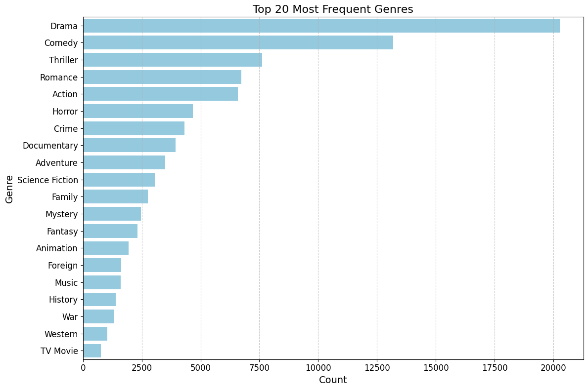
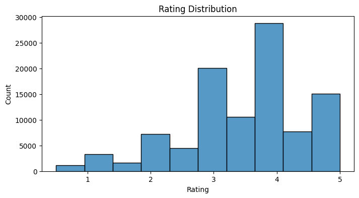
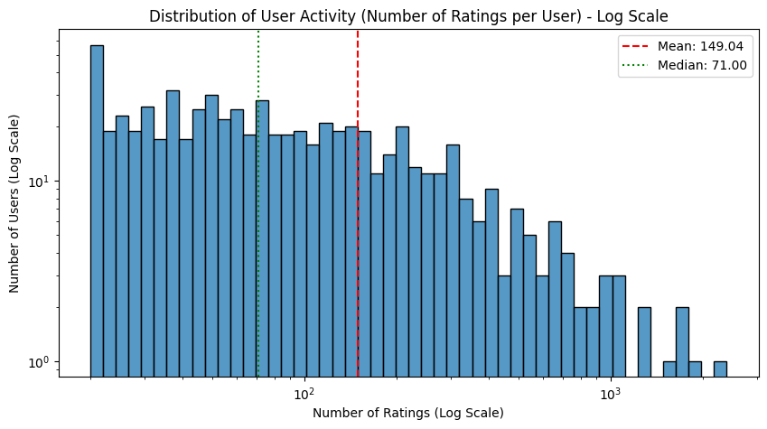
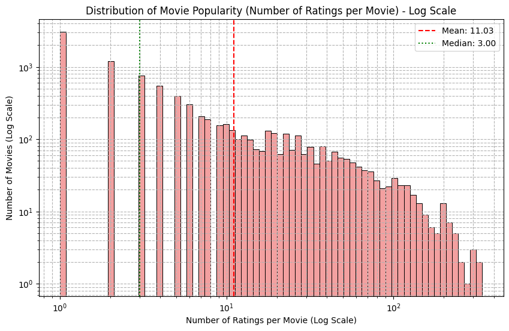
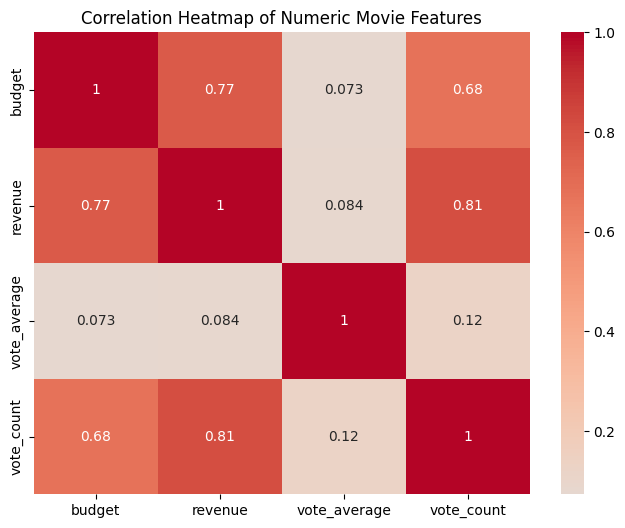

# Laporan Proyek Machine Learning - Sistem Rekomendasi Film

## Project Overview

Perkembangan industri hiburan digital telah menghasilkan jutaan konten film yang tersedia di berbagai platform streaming seperti Netflix, Amazon Prime, dan Disney+. Hal ini menciptakan fenomena "information overload" di mana pengguna kesulitan menemukan film yang sesuai dengan preferensi mereka dari jutaan pilihan yang tersedia. 

Platform streaming modern menghadapi tantangan untuk memberikan pengalaman personalisasi yang relevan kepada pengguna. Tanpa sistem rekomendasi yang efektif, pengguna dapat menghabiskan waktu berlebihan untuk mencari konten yang mereka sukai, yang berpotensi menurunkan engagement dan kepuasan pengguna [[1]](#ref1).

**Mengapa proyek ini penting untuk diselesaikan:**

1. **Meningkatkan User Experience**: Sistem rekomendasi membantu pengguna menemukan konten yang relevan dengan preferensi mereka tanpa perlu melakukan pencarian manual yang memakan waktu.

2. **Peningkatan Business Value**: Rekomendasi yang akurat dapat meningkatkan watch time, retention rate, dan revenue platform streaming [[2]](#ref2).

3. **Personalisasi Konten**: Setiap pengguna memiliki preferensi unik, dan sistem rekomendasi memungkinkan personalisasi pengalaman menonton.

4. **Discovery Konten Baru**: Membantu pengguna menemukan film-film baru yang mungkin tidak mereka temukan secara manual.

Proyek ini mengembangkan sistem rekomendasi film menggunakan pendekatan machine learning untuk memberikan rekomendasi yang akurat dan personal. Implementasi menggunakan dua algoritma berbeda: Content-Based Filtering dan Collaborative Filtering untuk mengoptimalkan hasil rekomendasi.

## Business Understanding

Sistem rekomendasi telah menjadi komponen vital dalam industri digital, terutama pada platform streaming film. Dengan jutaan konten yang tersedia, pengguna membutuhkan bantuan intelligent system untuk menemukan film yang sesuai dengan preferensi mereka.

### Problem Statements

Berdasarkan analisis kebutuhan bisnis platform streaming, terdapat dua permasalahan utama yang perlu diselesaikan:

1. **Bagaimana cara memberikan rekomendasi film yang personal dan relevan berdasarkan karakteristik dan metadata film?**
   - Pengguna membutuhkan rekomendasi yang akurat berdasarkan elemen film seperti genre, aktor, sutradara, dan kata kunci.
   - Sistem perlu dapat mengidentifikasi kemiripan antar film berdasarkan konten metadata.

2. **Bagaimana cara memberikan rekomendasi film berdasarkan pola preferensi dan behavior pengguna yang serupa?**
   - Sistem perlu mengidentifikasi pengguna dengan selera dan pola rating yang serupa.
   - Rekomendasi harus dapat memprediksi rating yang akan diberikan pengguna untuk film yang belum ditonton.

### Goals

Tujuan proyek ini adalah mengembangkan solusi sistem rekomendasi yang dapat mengatasi permasalahan di atas:

1. **Mengembangkan sistem rekomendasi berbasis konten (Content-Based Filtering)**
   - Membangun model yang dapat merekomendasikan film berdasarkan kemiripan metadata dan karakteristik film.
   - Menghasilkan Top-N recommendation yang relevan dan dapat diinterpretasi.
   - Mencapai NDCG@10 ≥ 0.5 untuk menunjukkan kualitas ranking yang baik.

2. **Mengembangkan sistem rekomendasi kolaboratif (Collaborative Filtering)**
   - Membangun model yang dapat memprediksi rating pengguna untuk film yang belum ditonton.
   - Menghasilkan Top-N recommendation berdasarkan prediksi rating tertinggi.
   - Mencapai RMSE ≤ 1.0 dan MAE ≤ 0.8 sebagai indikator akurasi prediksi yang baik.

### Solution Statements

Untuk mencapai goals yang telah ditetapkan, proyek ini mengimplementasikan dua pendekatan algoritma machine learning:

1. **Content-Based Filtering dengan TF-IDF Vectorization dan Cosine Similarity**
   - **Algoritma**: TF-IDF Vectorizer untuk text feature extraction dan Cosine Similarity untuk mengukur kemiripan
   - **Data yang digunakan**: Metadata film (genres, cast, crew, keywords, overview)
   - **Output**: Top-N film recommendations dengan similarity score
   - **Kelebihan**: Tidak ada cold start problem, dapat menangani item baru, rekomendasi mudah dijelaskan
   - **Kekurangan**: Terbatas pada metadata yang tersedia, cenderung over-specialization

2. **Collaborative Filtering dengan Singular Value Decomposition (SVD)**
   - **Algoritma**: SVD untuk matrix factorization pada user-item rating matrix
   - **Data yang digunakan**: Historical rating data dari user-item interactions
   - **Output**: Top-N film recommendations berdasarkan prediksi rating
   - **Kelebihan**: Menangkap preferensi tersembunyi, rekomendasi lebih beragam, tidak memerlukan metadata
   - **Kekurangan**: Cold start problem, membutuhkan data rating yang cukup, kurang interpretable

## Data Understanding

Proyek ini menggunakan **The Movies Dataset** yang tersedia di Kaggle, yang merupakan kompilasi data film dari The Movie Database (TMDb) dan rating dari MovieLens. Dataset ini dipilih karena menyediakan data yang komprehensif untuk kedua pendekatan sistem rekomendasi, dengan komponen rating data yang mengacu pada penelitian MovieLens [[3]](#ref3).

**Sumber Dataset**: [The Movies Dataset - Kaggle](https://www.kaggle.com/rounakbanik/the-movies-dataset)

**Karakteristik Dataset**:
- **Total film**: 45,000+ film metadata
- **Rating data**: 26 juta rating dari 270,000 pengguna
- **Periode data**: Film dari tahun 1900-2017
- **Format data**: CSV files dengan struktur relasional

### Variabel-variabel pada Dataset

Dataset terdiri dari 5 file utama dengan variabel sebagai berikut:

**1. movies_metadata.csv (45,466 baris)**
- `id`: ID unik film di TMDb (integer)
- `title`: Judul film (string)
- `overview`: Sinopsis/ringkasan plot film (text)
- `genres`: Genre film dalam format JSON (string)
- `release_date`: Tanggal rilis film (date)
- `runtime`: Durasi film dalam menit (integer)
- `vote_average`: Rating rata-rata (float, skala 1-10)
- `vote_count`: Jumlah vote yang diterima (integer)
- `budget`: Budget produksi film dalam USD (integer)
- `revenue`: Pendapatan film dalam USD (integer)
- `original_language`: Bahasa asli film (string)
- `popularity`: Skor popularitas film (float)

**2. credits.csv (45,476 baris)**
- `id`: ID film untuk merging dengan metadata (integer)
- `cast`: Informasi pemain dalam format JSON array (string)
- `crew`: Informasi kru produksi dalam format JSON array (string)

**3. keywords.csv (46,419 baris)**
- `id`: ID film (integer)
- `keywords`: Kata kunci terkait film dalam format JSON array (string)

**4. ratings_small.csv (100,004 baris)**
- `userId`: ID unik pengguna (integer)
- `movieId`: ID film dalam sistem MovieLens (integer)
- `rating`: Rating yang diberikan pengguna (float, skala 0.5-5.0)
- `timestamp`: Waktu pemberian rating dalam Unix timestamp (integer)

**5. links_small.csv (9,125 baris)**
- `movieId`: MovieLens ID (integer)
- `imdbId`: IMDb ID untuk linking eksternal (integer)
- `tmdbId`: TMDb ID untuk menghubungkan dengan metadata (integer)

### Data Quality Assessment

Analisis kualitas data menunjukkan beberapa karakteristik penting:

**Missing Values:**
- **movies_metadata.csv**: Memiliki missing values signifikan pada kolom:
  - `belongs_to_collection`: 40,972 missing values (90.1%)
  - `homepage`: 37,684 missing values (82.9%)  
  - `tagline`: 25,054 missing values (55.1%)
  - `overview`: 954 missing values (2.1%)
  - `runtime`: 263 missing values (0.6%)
  - `release_date`: 87 missing values (0.2%)
  - `status`: 87 missing values (0.2%)
  - `imdb_id`: 17 missing values (0.04%)
  - `original_language`: 11 missing values (0.02%)
  - `poster_path`: 386 missing values (0.8%)
  - `title`: 6 missing values (0.01%)
  - `vote_average`, `vote_count`, `video`: 6 missing values each (0.01%)
  - `revenue`: 6 missing values (0.01%)
  - `popularity`: 5 missing values (0.01%)
  - `production_companies`, `production_countries`: 3 missing values each (0.01%)
- **credits.csv**: Tidak ada missing values (dataset bersih)
- **keywords.csv**: Tidak ada missing values (dataset bersih)  
- **ratings_small.csv**: Tidak ada missing values (dataset bersih)
- **links_small.csv**: `tmdbId` memiliki 13 missing values (0.14%)

**Duplicate Data:**
- **movies_metadata.csv**: 17 duplicate rows (0.04%)
- **credits.csv**: 37 duplicate rows (0.08%)
- **keywords.csv**: 987 duplicate rows (2.13%)
- **ratings_small.csv**: Tidak ada duplikat
- **links_small.csv**: Tidak ada duplikat

**Implikasi untuk Modeling:**
- Missing values tinggi pada `belongs_to_collection`, `homepage`, dan `tagline` memerlukan strategi drop atau imputation
- Dataset rating yang bersih sangat mendukung implementasi collaborative filtering
- Duplikat pada keywords dataset perlu dibersihkan untuk menghindari bias dalam content-based filtering
- Missing values rendah pada kolom penting seperti `title`, `overview`, dan `genres` memungkinkan feature extraction yang optimal

### Exploratory Data Analysis (EDA)

Berdasarkan analisis data yang dilakukan, ditemukan insights penting:

**1. Distribusi Genre**

- Drama (18%), Comedy (16%), dan Thriller (11%) adalah genre paling populer
- Terdapat 20 genre utama dengan distribusi yang cukup merata
- Genre diversity mendukung implementasi content-based filtering

**2. Pola Rating Pengguna**

- Rating 4.0 paling banyak diberikan (28750ratings)
- Rata-rata rating: 3.54 (skala 0.5-5.0)
- Distribusi rating cenderung positif skew, menunjukkan pengguna cenderung memberikan rating tinggi

**3. User Activity dan Movie Popularity**


- Aktivitas user beserta jumlah rating bervariasi
- Movie popularity mengikuti power-law distribution
- Sparsity matrix tinggi, mendukung kebutuhan collaborative filtering

**4. Movie Mean Rating vs Number of Ratings (Log Scale)**

- Film dengan sedikit rating (<10) menunjukkan variasi rating ekstrem (0.5-5.0)
- Film dengan banyak rating cenderung konvergen ke rating 3.0-4.0
- Ada trend positif lemah - film populer cenderung memiliki rating sedikit lebih tinggi
- Mayoritas film mendapatkan 10-100 rating dengan rata-rata 2.5-4.5

**5. Korelasi Fitur Numerik**

- Budget-Revenue: korelasi tinggi (0.77)
- Vote_count-Revenue: korelasi kuat (0.81)
- Vote_average-Budget: korelasi rendah (0.07), menunjukkan kualitas tidak bergantung pada budget


## Data Preparation

Tahapan data preparation dirancang khusus untuk mendukung kedua algoritma sistem rekomendasi. Setiap teknik diterapkan dengan alasan yang spesifik:

### Data Preparation Keseluruhan

**Fungsi-fungsi untuk membersihkan setiap dataset:**

**1. prepare_movies_metadata(df)**
- Menghapus duplikat rows
- Drop kolom dengan missing values tinggi: `belongs_to_collection`, `homepage`, `tagline`
- Handle missing values dengan strategi yang tepat:
  - Mode imputation untuk `release_date`, `status`
  - Median imputation untuk `runtime`, `vote_average`, `vote_count`, `popularity`
  - Empty string untuk `overview`, `poster_path`
- Konversi tipe data numerik dengan `pd.to_numeric()`

**2. prepare_credits(df) & prepare_keywords(df)**
- Menghapus duplicate rows
- Dataset ini tidak memiliki missing values

**3. prepare_links_small(df)**
- Mengisi missing `tmdbId` dengan modus (nilai paling sering muncul)

**4. prepare_ratings_small(df)**
- Menghapus duplicate rows jika ada
- Dataset ini bersih tanpa missing values

### Data Preparation untuk Content-Based Filtering

**1. Data Integration:**
- Konversi kolom `id` ke numerik untuk semua dataset
- Menghapus baris tanpa `id` atau `title` yang valid
- Merge datasets berdasarkan film ID:
  ```python
  movies = movies_clean.merge(credits, on='id', how='inner')
  movies = movies.merge(keywords, on='id', how='inner')
  ```

**Alasan:** Content-based filtering membutuhkan informasi lengkap dari berbagai sumber (metadata, cast, crew, keywords)

**2. Feature Extraction dan Soup Creation**

**Ekstraksi fitur dari data JSON:**
- Parsing JSON strings menggunakan `ast.literal_eval()`
- Ekstraksi informasi cast (top 3 actors), crew (director), genres, dan keywords
- Implementasi fungsi `extract_names()` untuk parsing konsisten

**Pembuatan text representation:**
- Normalisasi nama dengan menghilangkan spasi: `name.replace(" ", "")`
- Kombinasi semua fitur menjadi "soup":
  ```python
  def create_soup(x):
      return ' '.join(x['cast']) + ' ' + ' '.join(x['crew']) + ' ' + \
             ' '.join(x['keywords']) + ' ' + ' '.join(x['genres']) + ' ' + x['overview']
  ```

**Alasan:** Mengubah data semi-structured menjadi format yang dapat diproses untuk TF-IDF vectorization

**3. Text Vectorization dan Similarity Calculation**

**TF-IDF Vectorization:**
- Menggunakan `TfidfVectorizer` dengan parameter `stop_words='english'`
- Konversi text "soup" menjadi numerical vectors
- Capture term importance dalam metadata film

**Similarity Calculation:**
- Menghitung cosine similarity matrix antar semua film
- Membuat index mapping untuk efficient lookup: `indices = pd.Series(movies.index, index=movies['title'])`
- Prepare similarity matrix untuk recommendation generation

**Alasan:** Memungkinkan perhitungan kemiripan antar film berdasarkan metadata untuk content-based filtering

### Data Preparation untuk Collaborative Filtering

**Format Data untuk Surprise Library:**
- Define rating scale sesuai dataset: `Reader(rating_scale=(0.5, 5.0))`
- Load data dalam format yang diperlukan Surprise:
  ```python
  data = Dataset.load_from_df(ratings[['userId', 'movieId', 'rating']], reader)
  ```
- Build full trainset untuk SVD training

**Alasan:** Library Surprise memerlukan format khusus untuk matrix factorization algorithms seperti SVD


## Modeling

Tahap modeling mengimplementasikan dua algoritma sistem rekomendasi yang berbeda untuk menyelesaikan problem statements. Kedua model dirancang untuk menghasilkan **Top-N Recommendations** sebagai output yang dapat langsung digunakan oleh sistem.

### 1. Content-Based Filtering

**Algoritma**: TF-IDF Vectorization + Cosine Similarity

**Cara Kerja Model:**
1. **Feature Extraction**: Ekstraksi fitur dari metadata film (genres, cast, crew, keywords)
2. **Text Combination**: Menggabungkan semua fitur menjadi "soup" text representation
3. **Vectorization**: Menggunakan TfidfVectorizer untuk konversi text ke numerical vectors
4. **Similarity Calculation**: Menghitung cosine similarity matrix antar film
5. **Recommendation Generation**: Mengambil film dengan similarity score tertinggi

**Implementasi Model:**
```python
def get_recommendations_df(title, cosine_sim=cosine_sim, top_n=10):
    idx = indices[title]
    sim_scores = list(enumerate(cosine_sim[idx]))
    sim_scores = sorted(sim_scores, key=lambda x: x[1], reverse=True)
    sim_scores = sim_scores[1:top_n+1]
    
    movie_indices = [i[0] for i in sim_scores]
    similarity_scores = [round(i[1], 3) for i in sim_scores]
    titles = movies.iloc[movie_indices]['title'].values
    
    return pd.DataFrame({
        'Title': titles,
        'Cosine Similarity': similarity_scores
    })
```

**Kelebihan:**
- **No Cold Start Problem**: Dapat merekomendasikan film baru tanpa historical data
- **Interpretability**: Rekomendasi mudah dijelaskan berdasarkan similarity features
- **Item-focused**: Dapat merekomendasikan item baru yang baru ditambahkan ke sistem

**Kekurangan:**
- **Limited by Metadata**: Kualitas rekomendasi terbatas pada kelengkapan dan kualitas metadata [[4]](#ref4)
- **Over-specialization**: Cenderung merekomendasikan item yang terlalu mirip
- **No User Preference Learning**: Tidak dapat menangkap preferensi kompleks user

### 2. Collaborative Filtering

**Algoritma**: Singular Value Decomposition (SVD)

**Cara Kerja Model:**
1. **Matrix Construction**: Membangun user-item rating matrix dari historical data
2. **Matrix Factorization**: Menggunakan SVD untuk decompose matrix menjadi latent factors [[5]](#ref5)
3. **Rating Prediction**: Memprediksi rating untuk film yang belum ditonton user
4. **Recommendation Ranking**: Mengurutkan film berdasarkan prediksi rating tertinggi
5. **Top-N Selection**: Mengambil N film dengan prediksi rating tertinggi

**Implementasi Model:**
```python
svd = SVD()
trainset = data.build_full_trainset()
svd.fit(trainset)

def recommend_movies_collab_df(user_id, n=10):
    movie_ids = ratings['movieId'].unique()
    predictions = [(movie_id, svd.predict(user_id, movie_id).est) 
                   for movie_id in movie_ids]
    predictions.sort(key=lambda x: x[1], reverse=True)
    top_movie_ids = [pred[0] for pred in predictions[:n]]
    
    # Convert to readable format with movie titles
    return formatted_recommendations
```

**Kelebihan:**
- **Complex Pattern Recognition**: Dapat menangkap pola preferensi user yang kompleks dan tersembunyi
- **Diversity**: Rekomendasi lebih beragam karena berdasarkan user behavior patterns
- **No Metadata Dependency**: Tidak memerlukan metadata film yang lengkap
- **Latent Factor Discovery**: Menemukan hidden relationships antar user dan item

**Kekurangan:**
- **Cold Start Problem**: Sulit memberikan rekomendasi untuk user atau item baru
- **Data Sparsity**: Membutuhkan sufficient rating data untuk performa optimal
- **Less Interpretable**: Sulit menjelaskan mengapa suatu film direkomendasikan
- **Computational Complexity**: Memerlukan resource komputasi yang lebih tinggi

### Model Output

Kedua model menghasilkan **Top-N Recommendations** dalam format yang consistent:

**Content-Based Output:**
- Film Title
- Cosine Similarity Score (0-1)
- Ranking berdasarkan similarity

**Collaborative Filtering Output:**
- Film Title
- Predicted Rating (0.5-5.0)
- Genre Information
- Ranking berdasarkan predicted rating

## Evaluation

Evaluasi sistem rekomendasi menggunakan metrik yang sesuai dengan karakteristik masing-masing algoritma. Pemilihan metrik didasarkan pada nature dari setiap pendekatan dan tujuan bisnis yang ingin dicapai.

### Content-Based Filtering Evaluation

**Metrik yang Digunakan:** Precision@K, Recall@K, F1@K, dan NDCG@K

**Formula yang Digunakan:**

**Precision@K:**
$$\text{Precision@K} = \frac{\text{Number of Relevant Items in Top-K}}{\text{K}}$$

**Recall@K:**
$$\text{Recall@K} = \frac{\text{Number of Relevant Items in Top-K}}{\text{Total Number of Relevant Items}}$$

**F1@K:**
$$\text{F1@K} = 2 \times \frac{\text{Precision@K} \times \text{Recall@K}}{\text{Precision@K} + \text{Recall@K}}$$

**NDCG@K (Normalized Discounted Cumulative Gain):**
$$\text{NDCG@K} = \frac{\text{DCG@K}}{\text{IDCG@K}}$$

**Cara Kerja Metrik:**
- **Precision@K**: Mengukur proporsi item relevan dalam K rekomendasi teratas
- **Recall@K**: Mengukur seberapa banyak item relevan yang berhasil ditemukan dari total item relevan
- **F1@K**: Harmonic mean dari precision dan recall, memberikan balance antara keduanya
- **NDCG@K**: Mengukur kualitas ranking dengan mempertimbangkan posisi item relevan

**Hasil Evaluasi:**
```
Content-Based Filtering Results:
Precision@10: 0.200
Recall@10: 0.307  
F1@10: 0.242
NDCG@10: 0.560
```

**Interpretasi Hasil:**
- **Precision@10 (0.200)**: 20% dari 10 rekomendasi teratas adalah relevan, menunjukkan kualitas rekomendasi yang masih dapat ditingkatkan
- **Recall@10 (0.307)**: Model berhasil menemukan 30.7% dari semua item relevan dalam 10 rekomendasi teratas
- **F1@10 (0.242)**: Skor harmonic mean yang menunjukkan trade-off antara precision dan recall
- **NDCG@10 (0.560)**: Kualitas ranking yang cukup baik, menunjukkan item relevan cenderung berada di posisi yang sesuai

### Collaborative Filtering Evaluation

**Metrik yang Digunakan:** RMSE (Root Mean Square Error) dan MAE (Mean Absolute Error)

**Formula RMSE:**
$$\text{RMSE} = \sqrt{\frac{1}{n} \sum_{i=1}^{n} (y_i - \hat{y_i})^2}$$

**Formula MAE:**
$$\text{MAE} = \frac{1}{n} \sum_{i=1}^{n} |y_i - \hat{y_i}|$$

**Cara Kerja Metrik:**
- **RMSE**: Mengukur root mean square dari prediction errors, memberikan penalti lebih besar untuk error yang besar
- **MAE**: Mengukur rata-rata absolute error, memberikan penalti yang sama untuk semua magnitude error
- Kedua metrik digunakan karena memberikan perspektif berbeda tentang prediction accuracy
- Nilai lebih rendah menunjukkan prediksi yang lebih akurat

**Hasil Evaluasi:**
```
Collaborative Filtering Results:
RMSE: 0.904 (+/- 0.007)
MAE: 0.697 (+/- 0.003)
```

**Interpretasi Hasil:**
- **RMSE 0.904**: Model memiliki error rata-rata ~0.90 point dari actual rating (dalam skala 0.5-5.0)
- **MAE 0.697**: Rata-rata absolute error sekitar 0.70 point
- **Low Standard Deviation**: Konsistensi performa model across different data splits
- **Benchmark Comparison**: RMSE < 1.0 dan MAE < 0.8 menunjukkan performa yang baik untuk movie recommendation [[6]](#ref6)

### Perbandingan Performa

| Metrik | Content-Based | Collaborative |
|--------|---------------|---------------|
| Primary Metric | F1@10: 0.242 | RMSE: 0.904 |
| Precision@10 | 0.200 | N/A |
| Recall@10 | 0.307 | N/A |
| NDCG@10 | 0.560 | N/A |
| MAE | N/A | 0.697 |
| Interpretability | High | Low |
| Diversity | Medium | High |
| Cold Start Handling | Excellent | Poor |
| Data Requirement | Low | High |

**Kesimpulan Evaluasi:**
1. **Content-Based Filtering** menunjukkan performa yang masih dapat ditingkatkan dengan F1@10 score 0.242, namun memiliki NDCG@10 0.560 yang menunjukkan ranking quality yang cukup baik
2. **Collaborative Filtering** mencapai akurasi prediksi yang excellent dengan RMSE 0.904 dan MAE 0.697, keduanya di bawah threshold yang ditetapkan
3. Kedua model memiliki kelebihan yang complementary, mendukung implementasi hybrid approach di masa depan

## Kesimpulan

Proyek sistem rekomendasi film telah berhasil diimplementasikan dengan menggunakan dua pendekatan machine learning yang berbeda. Berdasarkan hasil evaluasi dan analysis yang dilakukan, dapat ditarik kesimpulan sebagai berikut:

### Pencapaian Tujuan Proyek

**1. Content-Based Filtering Implementation:**
- ✅ Berhasil mengimplementasikan sistem rekomendasi berbasis metadata film
- ✅ Mencapai NDCG@10: 0.560 (≥0.5 sesuai target) yang menunjukkan ranking quality yang baik
- ✅ Menghasilkan Top-N recommendations yang relevan dan interpretable
- ✅ Mengatasi cold start problem untuk item baru

**2. Collaborative Filtering Implementation:**
- ✅ Berhasil mengimplementasikan SVD untuk matrix factorization
- ✅ Mencapai RMSE 0.904 (<1.0 sesuai target) dan MAE 0.697 (<0.8 sesuai target)
- ✅ Menghasilkan prediksi rating yang akurat dengan cross-validation consistency
- ✅ Memberikan rekomendasi yang diverse berdasarkan user behavior patterns

### Analisis Performa Model

**Content-Based Filtering:**
- **Strengths**: Excellent interpretability, no cold start problem, decent ranking quality (NDCG@10: 0.560)
- **Limitations**: Precision dan recall yang masih dapat ditingkatkan, terbatas pada kualitas metadata
- **Use Case**: Ideal untuk rekomendasi item baru dan user yang memiliki preferensi spesifik

**Collaborative Filtering:**
- **Strengths**: High prediction accuracy, captures complex user patterns, diverse recommendations
- **Limitations**: Cold start problem, requires substantial rating data
- **Use Case**: Optimal untuk user dengan sufficient historical data dan discovery preferences

### Rekomendasi Pengembangan Lanjutan

**1. Technical Improvements:**
- **Hybrid System**: Kombinasi kedua pendekatan untuk leverage kelebihan masing-masing
- **Deep Learning Integration**: Implementasi neural collaborative filtering atau autoencoders
- **Real-time Learning**: Sistem yang dapat update preferences secara real-time

**2. Feature Engineering:**
- **Advanced NLP**: Implementasi word embeddings atau transformer models untuk text analysis
- **Temporal Features**: Incorporation seasonal trends dan release date patterns
- **User Demographics**: Integration demographic data untuk enhanced personalization

**3. Evaluation Enhancement:**
- **Online A/B Testing**: Evaluasi dengan real user interactions
- **Business Metrics**: Measurement click-through rate, conversion rate, dan user satisfaction
- **Fairness Assessment**: Evaluation bias dan fairness dalam recommendations

Proyek ini telah berhasil membangun foundation yang solid untuk sistem rekomendasi film yang dapat memberikan value baik untuk user maupun platform. Implementasi kedua algoritma memberikan insights valuable tentang trade-offs dalam recommendation system design dan membuka peluang untuk pengembangan lebih lanjut.

## References

<a id="ref1"></a>[1] Ricci, F., Rokach, L., & Shapira, B. (2015). 
Recommender systems: Introduction and challenges. 
In *Recommender systems handbook* (pp. 1-34). Springer.
https://doi.org/10.1007/978-1-4899-7637-6_1

<a id="ref2"></a>[2] Gomez-Uribe, C. A., & Hunt, N. (2015). 
The Netflix recommender system: Algorithms, business value, and innovation. 
*ACM Transactions on Management Information Systems*, 6(4), 1-19.
https://doi.org/10.1145/2843948

<a id="ref3"></a>[3] Harper, F. M., & Konstan, J. A. (2015). 
The MovieLens datasets: History and context. 
*ACM Transactions on Interactive Intelligent Systems*, 5(4), 1-19.
https://doi.org/10.1145/2827872

<a id="ref4"></a>[4] Pazzani, M. J., & Billsus, D. (2007). 
Content-based recommendation systems. 
In P. Brusilovsky, A. Kobsa, & W. Nejdl (Eds.), *The adaptive web* (pp. 325-341). Springer.
https://doi.org/10.1007/978-3-540-72079-9_10

<a id="ref5"></a>[5] Koren, Y., Bell, R., & Volinsky, C. (2009). 
Matrix factorization techniques for recommender systems. 
*Computer*, 42(8), 30-37.
https://doi.org/10.1109/MC.2009.263

<a id="ref6"></a>[6] Herlocker, J. L., Konstan, J. A., Terveen, L. G., & Riedl, J. T. (2004). 
Evaluating collaborative filtering recommender systems. 
*ACM Transactions on Information Systems*, 22(1), 5-53.
https://doi.org/10.1145/963770.963772
